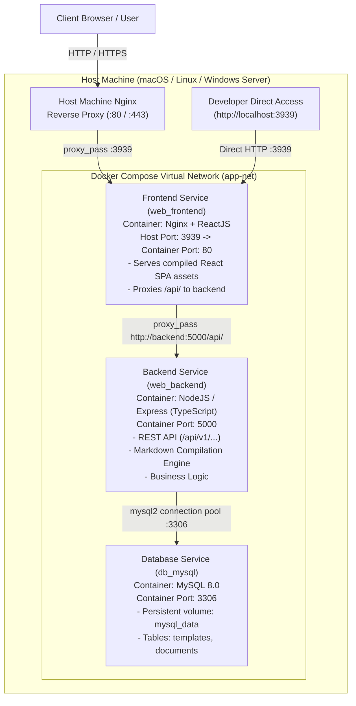

# System Architecture Overview

This document describes the multi-service containerized architecture of the DocForge application platform.

---

## 1. High-Level Container Topology

The application is structured into isolated tiers orchestrated by Docker Compose on a dedicated virtual bridge network (`app-net`):

---

## 2. Service Responsibilities

### 1. Frontend Service (`src/frontend`)
- **Technology**: React 18 / TypeScript / Vite / Tailwind CSS / Lucide Icons / Nginx.
- **Container Architecture**:
  - Built via a multi-stage Dockerfile (`builder` compiles React SPA, `runner` uses Nginx Alpine).
  - Nginx serves the static HTML/JS/CSS bundle and handles client-side SPA routing (`try_files $uri $uri/ /index.html`).
  - Nginx acts as an internal reverse proxy for all `/api/` traffic, routing requests directly to `http://backend:5000/api/`.
- **Developer & Host Access**:
  - The developer can directly access the container's Nginx on host port `3939` (`http://localhost:3939`).
  - In production, the Host machine's Nginx proxies incoming public traffic into this port.

### 2. Backend API Service (`src/backend`)
- **Technology**: Node 20 / Express / TypeScript / `mysql2`.
- **Responsibilities**:
  - Exposes RESTful endpoints under `/api/v1/` for Templates and Documents.
  - Compiles structured document elements into pure GitHub-Flavored Markdown.
  - Executes schema verification and seeds default templates (ADR, PRD, Postmortem) on startup.

### 3. Database Service (`mysql`)
- **Technology**: MySQL 8.0 with InnoDB engine and UTF-8 Unicode charset.
- **Data Persistence**: Backed by named volume `mysql_data`.
- **Tables**: `templates` and `documents` with JSON element schemas and compiled Markdown stores.

---

## 3. Communication Flows

1. **Development Direct Access**:
   - Developer opens `http://localhost:3939` in their browser.
   - Container Nginx receives the connection on port 80, serves the React application, and transparently routes `/api/v1/*` requests to the Node.js backend.
2. **Production Host Nginx Access**:
   - External clients connect to the Host Nginx on port 80 or 443 (SSL).
   - Host Nginx forwards to `http://127.0.0.1:3939`.
   - See [`host-nginx-example.conf`](host-nginx-example.conf) for configuration reference.
