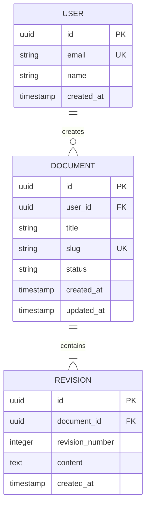

# Data Models & Schemas

This directory documents database schemas, entity relationship diagrams (ERDs), cache structures, and message bus contracts.

---

## 1. Schema Conventions
- Table names must be pluralized, lowercase snake_case (e.g. `users`, `document_revisions`).
- All primary keys must be UUIDv7 or auto-incrementing 64-bit integers (`bigint`).
- All tables must include audit timestamps:
  - `created_at`: `TIMESTAMP WITH TIME ZONE NOT NULL DEFAULT NOW()`
  - `updated_at`: `TIMESTAMP WITH TIME ZONE NOT NULL DEFAULT NOW()`

---

## 2. Core Entity Relationship (Example)

