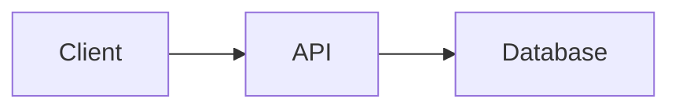

# Architecture & Design Diagrams

This directory stores standalone diagram source files and exports.

## Preferred Formats
1. **Mermaid (`.mmd`)**: Strongly preferred because Mermaid source files can be version-controlled, reviewed via Git pull requests, and previewed directly in GitHub/GitLab.
2. **PlantUML (`.puml`)**: For complex sequence diagrams.
3. **SVG (`.svg`)**: For vector graphics and exported diagrams.

## Embedding in Markdown
To embed a Mermaid diagram in any markdown file, use the markdown fenced code block:

````markdown

````
