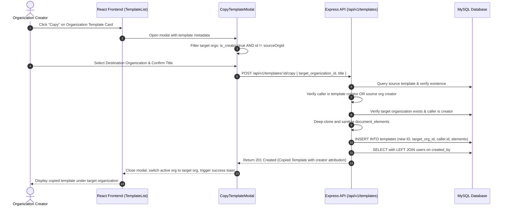

# RFC-0003: Template Copy Across Organizations

- **Status**: Implemented
- **Author**: Platform Architecture Team, Antigravity AI Assistant
- **Created**: 2026-10-04
- **Target Component**: Full Stack (Frontend UI, Express API, MySQL Database, Test Suite)

---

## 1. Summary
This document specifies the technical design for duplicating document templates from one organization to another organization created by the user. It establishes role-based authorization rules to ensure templates can only be copied into target organizations where the user has creator authority, deep-clones complex document element schemas, adds creator attribution across templates, and provides a streamlined modal and card interaction in the React frontend.

## 2. Motivation
In team workflows, engineers and managers develop standardized documentation blueprints (such as Architecture Decision Records, Product Requirement Documents, Release Runbooks, and Incident Postmortems) tailored to their organization. As users establish multiple organizations (such as departmental squads, partner teams, or specialized workspaces), they require a seamless mechanism to replicate battle-tested templates into their other organizations without manual error-prone recreation.

## 3. Proposed Design & Architecture



## 4. API & Data Model Changes

### 4.1 Endpoint: `POST /api/v1/templates/:id/copy`
- **Authentication**: Required (`Authorization: Bearer <token>`).
- **Path Parameters**:
  - `id`: Unique identifier of the source template.
- **Request Body**:
  ```json
  {
    "target_organization_id": "org-5678",
    "title": "Incident Postmortem (Optional Custom Title)"
  }
  ```
- **Responses**:
  - `201 Created`: Returns newly created template JSON.
  - `400 Bad Request`: Target organization missing or identical to source organization.
  - `403 Forbidden`: User is neither template creator nor source organization creator, or is not the creator of the target organization.
  - `404 Not Found`: Source template or target organization not found.

### 4.2 Template Model Additions
Both backend and frontend models now include creator metadata:
```typescript
export interface Template {
  id: string;
  title: string;
  description: string;
  category: string;
  icon: string;
  visibility: TemplateVisibility;
  organization_id: string | null;
  created_by: string | null;
  creator_name?: string;
  creator_username?: string;
  tags: string[];
  document_elements: DocumentElementConfig[];
  created_at: string;
  updated_at: string;
}
```

## 5. Migration & Rollout Plan
- Zero database DDL migration required: uses existing `templates` and `organizations` tables with standard SQL queries.
- Backward-compatible API payload accepts both `target_organization_id` and legacy `target_team_id`.
- Automated regression test suite added to `tests/integration/test_template_copy.py`.

## 6. Drawbacks & Alternatives Considered
- **Alternative Considered**: Allowing any organization member to copy templates to their own organizations.
  - **Reason Rejected**: Proprietary organization templates should not be exfiltrated without creator authority; restricting source copy permissions to template creators and organization creators respects organizational governance boundaries.
- **Alternative Considered**: Sharing templates via global public visibility.
  - **Reason Rejected**: Many organizations develop internal-only workflows that cannot be published globally to unauthenticated guest visitors.
