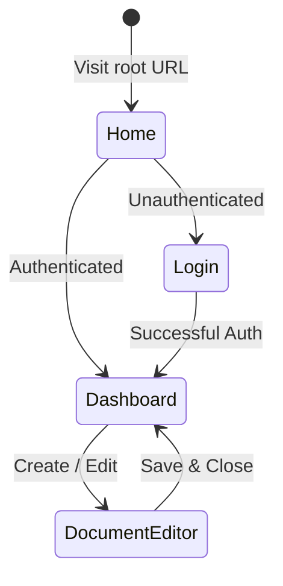

# UI & UX Design Specifications

This directory contains user interface design tokens, wireframes, user flow diagrams, and design system documentation.

---

## 1. Design Tokens

### Color Palette (Tailwind CSS / CSS Variables)
- **Primary**: `#2563eb` (Blue-600)
- **Secondary**: `#475569` (Slate-600)
- **Background**: `#ffffff` (Dark: `#0f172a`)
- **Surface**: `#f8fafc` (Dark: `#1e293b`)
- **Border**: `#e2e8f0` (Dark: `#334155`)

### Typography
- **Headings & Body**: Inter, system-ui, -apple-system, sans-serif.
- **Code & Monospace**: JetBrains Mono, Fira Code, Menlo, monospace.

---

## 2. Navigation Flow

