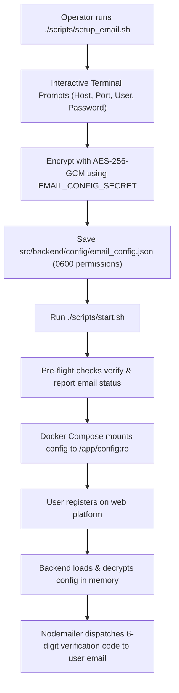

# Email Configuration & SMTP Setup Guide (`email_config.json`)

This runbook documents how to configure, encrypt, test, and operate the email service in DocForge. The email service is used to dispatch account verification tokens to users during registration.

---

## 1. Overview & Architecture

* **Configuration File**: [`src/backend/config/email_config.json`](../../../src/backend/config/email_config.json)
* **Encryption Standard**: AES-256-GCM (Authenticated Encryption with Associated Data)
* **Default Encryption Key**: Saved as `EMAIL_CONFIG_SECRET=docforge-email-secret-key-2026` in `.env`, `.env.dev`, and `.env.prod`.
* **Management Tool**: [`scripts/setup_email.sh`](../../../scripts/setup_email.sh) and [`scripts/manage_email_config.py`](../../../scripts/manage_email_config.py)
* **Application Startup**: [`scripts/start.sh`](../../../scripts/start.sh) automatically verifies, mounts, and loads the configuration into the backend container.



---

## 2. Setting Up Email Configuration (Interactive CLI)

The setup process is strictly command-line driven with interactive prompts and masked password input.

### Command Line
Run the setup script from the project root:

```bash
./scripts/setup_email.sh
```

*(Alternatively: `python3 scripts/manage_email_config.py setup`)*

### Interactive Prompts & Options:
1. **SMTP Server Host**: Hostname of your SMTP provider (e.g. `smtp.gmail.com`, `smtp.mailgun.org`, `smtp.appunity.net`). Default is `smtp.appunity.net`.
2. **SMTP Server Port**:
   - `587`: Standard port for STARTTLS (recommended).
   - `465`: Direct SSL/TLS.
   - `25`: Plain / local relay.
3. **Use direct SSL/TLS? (y/n)**: Select `y` for port 465, or `n` for port 587/25.
4. **Email Account / Username**: Account email used for authentication (e.g. `notifications@example.com`).
5. **SMTP Password / App Secret**: Masked input (hidden typing). If a password is already saved, pressing `Enter` keeps the current encrypted password.
6. **Sender / From Address**: Display name and email (e.g. `DocForge Security <notifications@example.com>`).
7. **Test Connection Prompt**: Prompts `Would you like to test the SMTP connection now? [y/N]`. If selected, connects via SMTP and optionally sends a verification test email to an inbox.

---

## 3. Non-Interactive / Scripted Setup

For automation, provisioning scripts, or CI/CD pipelines, flags can be passed directly:

```bash
python3 scripts/manage_email_config.py setup \
  --server smtp.gmail.com \
  --port 587 \
  --secure false \
  --account "notifications@example.com" \
  --password "my-app-password" \
  --from-address "DocForge Alerts <notifications@example.com>" \
  --test "admin@example.com" \
  --non-interactive
```

---

## 4. Automatic Loading via `scripts/start.sh`

Once the email configuration is saved, `./scripts/start.sh` automatically handles verification and container loading:

```bash
# Standard startup (automatically loads existing email_config.json):
./scripts/start.sh

# Or launch the interactive email wizard before starting:
./scripts/start.sh --email
```

### Startup Pre-Flight Output
When starting, `scripts/start.sh` validates the configuration and reports its active state:

```text
==> Verifying encrypted email configuration...
✓ [Email Service] Server: smtp.gmail.com:587 | Account: notifications@example.com | Password: Active / Encrypted
```

### Docker Volume Mounting
In `docker-compose.yml`, the configuration directory is mounted read-only:
```yaml
backend:
  environment:
    - EMAIL_CONFIG_SECRET=${EMAIL_CONFIG_SECRET:-docforge-email-secret-key-2026}
  volumes:
    - ./src/backend/config:/app/config:ro
```
Any updates made on the host via `./scripts/setup_email.sh` take effect immediately without needing to rebuild container images.

---

## 5. Verification Email Dispatch During User Registration

When a new user registers on DocForge (`POST /api/v1/auth/register`):
1. The backend generates a temporary 6-digit verification code.
2. It decrypts `email_config.json` in memory using `EMAIL_CONFIG_SECRET`.
3. If valid SMTP credentials are configured, it dispatches an email to the user's account with the activation code.
4. **Development Fallback**: If no SMTP password is configured (default local environment), the verification code is logged to the server console:
   ```text
   ===============================================================
   [Email Dispatch] Verification Token sent to: user@example.com
     • Sender Account: service@appunity.net via smtp.appunity.net:587
     • Verification Code: 481920
     • Validity: 30 seconds
   ===============================================================
   ```
   This ensures local development and automated testing are never blocked by external SMTP dependencies.

---

## 6. CLI Management Commands Reference

| Action | Command | Description |
| :--- | :--- | :--- |
| **Interactive Setup** | `./scripts/setup_email.sh` | Launch step-by-step terminal wizard to update SMTP settings. |
| **View Config** | `python3 scripts/manage_email_config.py view` | Decrypt and display configuration (password masked as `********`). |
| **Check Status** | `python3 scripts/manage_email_config.py status` | Display single-line status of current SMTP server and account. |
| **Test Connection** | `python3 scripts/manage_email_config.py test [recipient]` | Test SMTP server handshake and optionally send test message. |
| **Reset Defaults** | `python3 scripts/manage_email_config.py set-defaults` | Reset `email_config.json` to factory encrypted defaults. |
| **Ensure Encrypted** | `python3 scripts/manage_email_config.py ensure-encrypted` | Ensure configuration exists and is encrypted with AES-256-GCM. |

---

## 7. Troubleshooting

* **Gmail `535 Authentication Failed`**: Google requires an **App Password** for SMTP. Generate one under *Google Account > Security > 2-Step Verification > App passwords*.
* **Connection Timeout on Port 465**: Port 465 requires direct SSL (`secure: true`). For STARTTLS, use port 587 (`secure: false`).
* **Decryption Error**: If `EMAIL_CONFIG_SECRET` in `.env` is modified after `email_config.json` was saved, re-run `./scripts/setup_email.sh` to re-encrypt with the new secret key.
