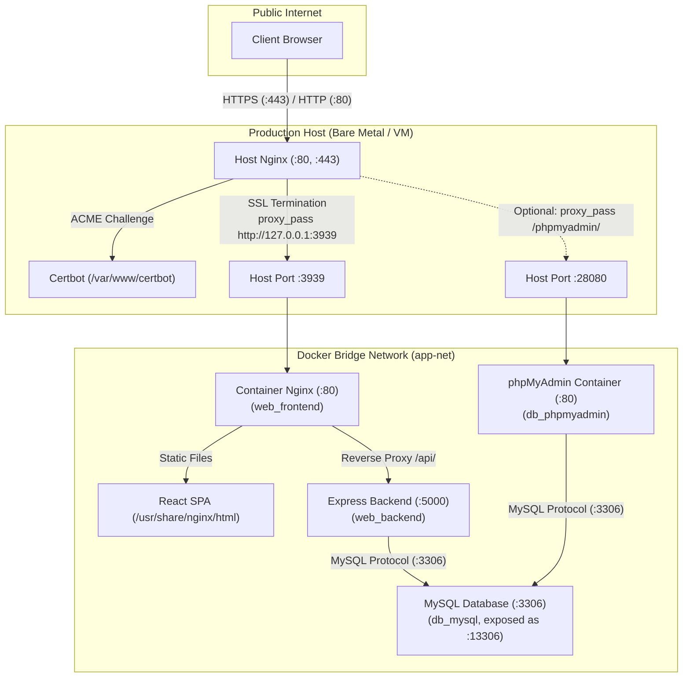

# Two-Tier Nginx Proxy & Deployment Architecture

This document details the multi-tier reverse proxy topology connecting the **Host Machine Nginx** with the **Containerized Application Nginx**, managing HTTPS termination with Certbot, dynamic domain configuration, and optional services such as phpMyAdmin.

---

## 1. Architectural Topology



---

## 2. Separation of Responsibilities

| Tier | Component | Location | Role & Functionality |
| :--- | :--- | :--- | :--- |
| **Edge / Ingress** | **Host Nginx** | Host OS (`/etc/nginx/`) | • Binds public ports `80` and `443`.<br>• Serves Certbot ACME webroot (`/.well-known/acme-challenge/`).<br>• Redirects HTTP to HTTPS.<br>• Terminates SSL / TLS via Let's Encrypt certificates.<br>• Reverse proxies decrypted traffic to local Docker port (`127.0.0.1:3939`).<br>• Handles WebSocket upgrades for real-time traffic. |
| **Presentation** | **Container Nginx** | Docker Container (`web_frontend`) | • Serves compiled React SPA static assets (`dist/`).<br>• Implements Gzip compression and client asset caching.<br>• Resolves client SPA routing fallbacks (`try_files $uri /index.html`).<br>• Proxies `/api/` traffic internally to `http://backend:5000/api/` (no CORS friction). |
| **Application** | **Node.js Backend** | Docker Container (`web_backend`) | • Executes business logic, REST APIs, and database migrations. |
| **Database** | **MySQL 8.0** | Docker Container (`db_mysql`) | • Persistent relational store in Docker volume `mysql_data` (mapped to host `:13306`). |
| **DB Admin (Optional)**| **phpMyAdmin** | Docker Container (`db_phpmyadmin`) | • Web UI for MySQL database administration on host port `28080` (managed via `--profile phpmyadmin`). |

---

## 3. Configuration Templates

- [`docs/ops/nginx/host-nginx.conf.template`](host-nginx.conf.template): Full production configuration for Host Nginx with SSL termination, Certbot webroot, WebSocket headers, and reverse proxy forwarding.
- [`docs/ops/nginx/host-nginx-bootstrap.conf.template`](host-nginx-bootstrap.conf.template): Port 80 HTTP-only configuration used during first-time deployment before SSL certificates exist on disk.
- [`src/frontend/nginx.conf`](../../../src/frontend/nginx.conf): Container Nginx configuration serving the React frontend bundle and internal `/api/` proxying.

---

## 4. Application Startup & Management CLI (`scripts/start.sh`)

### 4.1 Development Start (Default)
Running `./scripts/start.sh` without flags starts the stack in **Development mode** with **phpMyAdmin enabled automatically**:
```bash
./scripts/start.sh
```
- Frontend: `http://localhost:3939`
- Backend API: `http://localhost:5000`
- MySQL: `localhost:13306`
- phpMyAdmin: `http://localhost:28080`

### 4.2 Production Start (`--prod`)
In production, phpMyAdmin is **disabled by default**:
```bash
./scripts/start.sh --prod
```
To enable phpMyAdmin in production:
```bash
./scripts/start.sh --prod -pma
```

### 4.3 First-Time Production Setup & Nginx Generation (`--prod --init`)
Prompts for the target domain (default: `doc-forge.appunity.net`) and generates the Host Nginx SSL configuration:
```bash
./scripts/start.sh --prod --init
```
Or pass the domain directly:
```bash
./scripts/start.sh --prod --init -d doc-forge.appunity.net
```

### 4.4 Rebuilding Images
- **Rebuild with Docker cache**:
  ```bash
  ./scripts/start.sh --build
  ```
- **Clean rebuild without cache**:
  ```bash
  ./scripts/start.sh --build --no-cache
  ```

### 4.5 Teardown & Stopping Containers (`scripts/stop.sh`)
- **Graceful stop & removal of containers** (preserves database data):
  ```bash
  ./scripts/stop.sh
  ```
- **Stop containers without removing them**:
  ```bash
  ./scripts/stop.sh --stop
  ```
- **Complete teardown including volume wipe**:
  ```bash
  ./scripts/stop.sh --volumes
  ```

---

## 5. SSL / Certbot Setup for Host Nginx

1. **DNS Setup**: Ensure `doc-forge.appunity.net` points to the production server IP.
2. **Generate Host Nginx Config**:
   ```bash
   ./scripts/start.sh --init -d doc-forge.appunity.net
   ```
3. **Install Host Nginx Config**:
   ```bash
   sudo cp docs/ops/nginx/generated/doc-forge.appunity.net.conf /etc/nginx/sites-available/doc-forge.appunity.net.conf
   sudo ln -sf /etc/nginx/sites-available/doc-forge.appunity.net.conf /etc/nginx/sites-enabled/
   ```
4. **Issue SSL Certificate**:
   ```bash
   sudo certbot certonly --webroot -w /var/www/certbot -d doc-forge.appunity.net
   ```
5. **Reload Nginx**:
   ```bash
   sudo nginx -t && sudo systemctl reload nginx
   ```
