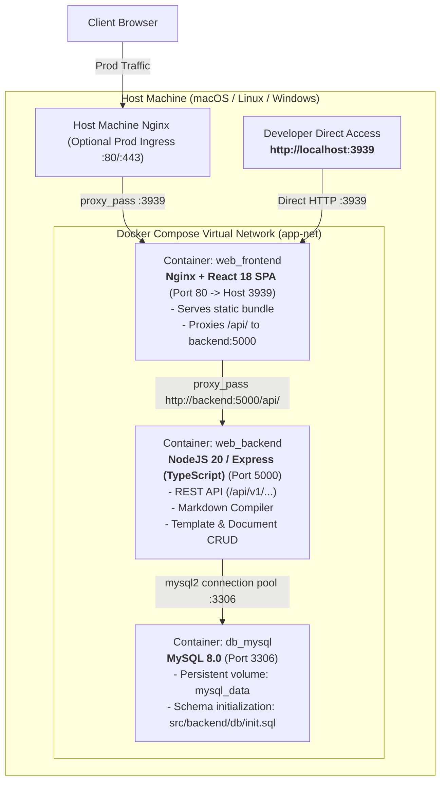

# Cross-Machine Development Handoff & Setup Guide

- **Date**: 2026-09-11
- **Target Audience**: Any Developer or AI Coding Assistant resuming this project on a new workstation (macOS, Linux, Windows/WSL2, or Dev Containers).
- **Active Branch**: `main`
- **Application**: DocForge - Template-Driven Document Configuration & Authoring Platform.

---

## 1. Quick Start on Any New Machine

### Prerequisites
- Docker & Docker Compose (v24+ / Compose v2+)
- Git (configured for LF line endings, handled automatically by `.gitattributes`)

### Commands to Run
```bash
# 1. Clone or pull the repository
git pull origin main

# 2. (Optional) Initialize environment config
cp docs/ops/config-templates/.env.example .env

# 3. Build and launch all container tiers
docker compose up --build -d

# 4. Stream logs to verify database initialization
docker compose logs -f
```

### Verification URLs
- **Web App & Ingress (Container Nginx)**: [http://localhost:3939](http://localhost:3939)
- **API Health via Nginx Proxy**: [http://localhost:3939/api/v1/health](http://localhost:3939/api/v1/health)
- **Backend API Direct (Debugging)**: [http://localhost:5000/api/v1/health](http://localhost:5000/api/v1/health)
- **MySQL Database**: `localhost:3306` (User: `docuser`, Pass: `docpass`, DB: `docforge`)

---

## 2. Architecture & Service Topology



---

## 3. Key Implemented Features

1. **Template Configuration Setup (`TemplateBuilder.tsx`)**:
   - **Document Item Hierarchy Levels**: Assign items to Level 1 (`## `), Level 2 (`### `), or Level 3 (`#### `) with visual tree indentation (`ml-0`, `ml-6`, `ml-12`) and **Indent (`>`)** / **Outdent (`<`)** buttons.
   - **Special Repeatable Document Item**: Field type `repeatable_list` creates a dynamic item container.
   - **Supported Element Types**: `markdown`, `repeatable_list`, `short_text`, `select`, `callout`, `code`, `checklist`.
   - **Live Structure Preview**: Real-time visual representation of document structure.
2. **Document Authoring & Dynamic Edit Mode (`DocumentEditor.tsx`)**:
   - Dynamic form constructed strictly from template's `document_elements`.
   - **The `+` Button for Repeatable Items**: Authors click `+ Add New Item to "{Section}"` while writing to spawn child items on the fly (each with title and markdown editor).
   - **Hierarchical Outline**: Left sidebar displays nested Table of Contents (`↳`) with filled/empty progress indicators.
   - **Markdown Toolbar**: Quick insertion of H2, H3, bold, italic, code, lists, checklists, quotes, and tables.
   - **Split View**: Side-by-side editing and real-time compiled markdown preview.
3. **View & Preview Mode (`DocumentViewer.tsx`)**:
   - Reader view with clean typographic hierarchy (`.prose-custom`).
   - One-click **Copy Markdown** to clipboard.
   - One-click **Download `.md`** file.
   - **Print / PDF** formatted layout.

---

## 4. Codebase Navigation Map

| Path | Purpose |
| :--- | :--- |
| `docker-compose.yml` | Container definitions for `frontend`, `backend`, and `mysql`. |
| `src/frontend/nginx.conf` | Container Nginx config with SPA routing and `/api/` proxy. |
| `src/frontend/Dockerfile` | Multi-stage build (Node 20 build &rarr; Nginx Alpine runtime). |
| `src/frontend/src/components/templates/` | `TemplateList.tsx` and `TemplateBuilder.tsx`. |
| `src/frontend/src/components/documents/` | `DocumentList.tsx`, `DocumentEditor.tsx`, `DocumentViewer.tsx`, `CreateDocumentModal.tsx`, `MarkdownToolbar.tsx`. |
| `src/backend/Dockerfile` | Node 20 TypeScript backend container. |
| `src/backend/src/db.ts` | MySQL connection pool and self-healing schema/seed initializer. |
| `src/backend/src/compiler.ts` | Markdown compilation engine handling heading levels and repeatable lists. |
| `src/backend/src/routes/` | Express routers for templates and documents. |
| `src/backend/db/init.sql` | MySQL DDL schema and seed templates (ADR, PRD, Postmortem). |
| `docs/memory/context/` | AI agent context bank (`project-context.md`, `system-patterns.md`, `active-context.md`). |
| `docs/memory/decisions/` | ADR registry (`0001`, `0002`, `0003`). |
| `docs/design/rfcs/` | RFC specifications (`0001`, `0002`). |
| `docs/design/architecture/` | `00-system-overview.md` and `host-nginx-example.conf`. |

---

## 5. Rules for Developers & AI Assistants on Other Machines

1. **No Hardcoded Machine Paths**: Never write paths containing machine-specific prefixes like `/home/username/` or `C:\Users\...`. Use relative paths or environment variables.
2. **POSIX Path Separators**: Always use forward slashes (`/`) in markdown links, Docker configurations, and scripts.
3. **Keep Local State Local**: Developer notes, local scratchpads, and secrets belong in `docs/memory/local/` or `.env` and are strictly gitignored.
4. **Scaffolding Automation**: Use `python3 scripts/new_record.py` to create new numbered ADRs, RFCs, PRDs, and Handoffs.
5. **Always Update Handoff**: When ending a session or moving machines, commit an updated handoff record under `docs/tasks/handoffs/`.
