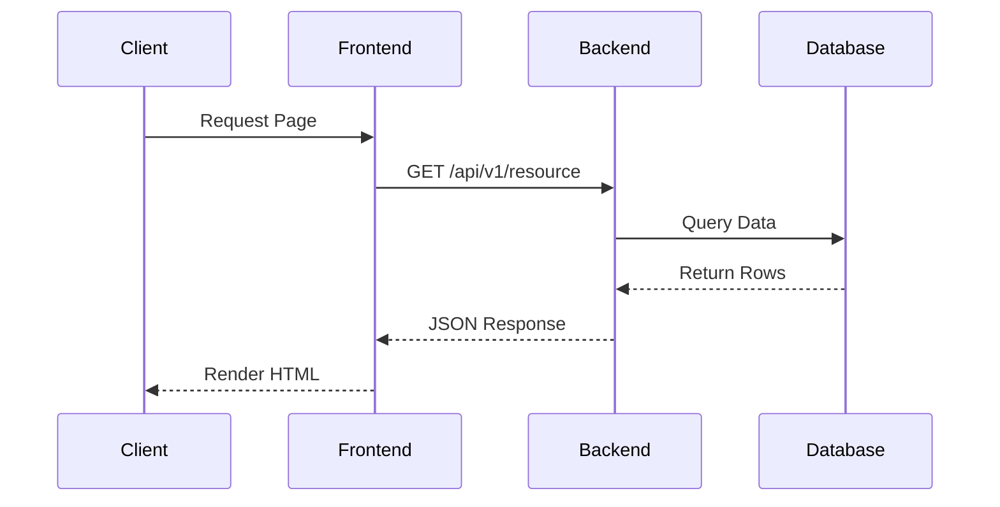

# Design Specification: [Component / Module Name]

- **Component**: [e.g. src/backend/auth]
- **Author**: [Author Name]
- **Date**: YYYY-MM-DD
- **Related RFC / ADR**: [Link to RFC or ADR]

---

## 1. Overview
High-level responsibility of this component or module within the service.

## 2. Public Interfaces & Contracts
Methods, classes, or endpoints exposed to other modules or services.

## 3. Internal Data Flow & Sequence

## 4. Error Handling & Edge Cases
How the component recovers from network errors, invalid input, or external outages.
