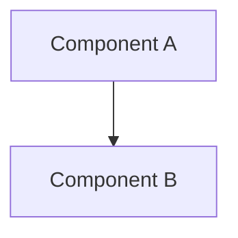

# RFC-[NUMBER]: [Technical Proposal Title]

- **Status**: Draft | Under Review | Accepted | Rejected | Implemented
- **Author**: [Author Name]
- **Created**: YYYY-MM-DD
- **Target Component**: [e.g. Frontend / Backend / Infrastructure]

---

## 1. Summary
A brief 1-2 paragraph description of the proposed architectural change.

## 2. Motivation
Why is this change necessary? What limitations in the current design does it address?

## 3. Proposed Design & Architecture
Detailed technical proposal with Mermaid diagrams and code snippets.

## 4. API & Data Model Changes
Any updates required to REST endpoints, database schemas, or event payloads.

## 5. Migration & Rollout Plan
How will this be deployed without downtime or breaking existing clients?

## 6. Drawbacks & Alternatives Considered
What alternatives were evaluated? Why was this option chosen?
